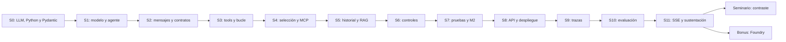

# Mapa pedagógico del curso

Recorrido para planificar clases y ubicar conceptos, laboratorios y evaluaciones.
S0 es nivelación; S1–S11 y el seminario constituyen las 72 h; Foundry es bonus opcional.

## Recorrido y trazabilidad

| Sesión | Introducción y teoría | Ejemplo / implementación | Práctica | Evaluación |
|---|---|---|---|---|
| S0 | [LLM y entorno](../00-preparacion/README.md) | Cuatro demos en `00-preparacion/code/` | Cuentas, Python, Pydantic | [Autoevaluación 8/10](../00-preparacion/autoevaluacion.md) |
| S1 | [Fundamentos de agentes](../modulo-1-fundamentos/sesion-01-fundamentos-agentes/README.md) | [Demos](../modulo-1-fundamentos/sesion-01-fundamentos-agentes/code/README.md) y [checkpoint](../modulo-1-fundamentos/sesion-01-fundamentos-agentes/solucion/) | [L1](../modulo-1-fundamentos/sesion-01-fundamentos-agentes/lab/README.md): Primer script con provider | Test 1 + aceptación L1 |
| S2 | [Mensajes, prompts y salida estructurada](../modulo-1-fundamentos/sesion-02-ecosistema-langchain/README.md) | [Demos](../modulo-1-fundamentos/sesion-02-ecosistema-langchain/code/README.md) y [checkpoint](../modulo-1-fundamentos/sesion-02-ecosistema-langchain/solucion/) | [L2](../modulo-1-fundamentos/sesion-02-ecosistema-langchain/lab/README.md): Clasificador tipado y medición | Test 2 + pase Pydantic + L2 |
| S3 | [Tool Calling y API externa](../modulo-1-fundamentos/sesion-03-tools-api-externa/README.md) | [Demos](../modulo-1-fundamentos/sesion-03-tools-api-externa/code/README.md) y [checkpoint](../modulo-1-fundamentos/sesion-03-tools-api-externa/solucion/) | [L3](../modulo-1-fundamentos/sesion-03-tools-api-externa/lab/README.md): Tool de lectura; tres escenarios A1 | Assignment A1 (100 % M1) |
| S4 | [Catálogo de tools y MCP](../modulo-2-agentes-avanzados/sesion-04-tools-multiples/README.md) | [Demos](../modulo-2-agentes-avanzados/sesion-04-tools-multiples/code/README.md) y [checkpoint](../modulo-2-agentes-avanzados/sesion-04-tools-multiples/solucion/) | [L4](../modulo-2-agentes-avanzados/sesion-04-tools-multiples/lab/README.md): Cuatro tools; matriz ≥85 % | Aceptación L4; Proyecto M2 |
| S5 | [Memoria y RAG](../modulo-2-agentes-avanzados/sesion-05-memoria-rag/README.md) | [Demos](../modulo-2-agentes-avanzados/sesion-05-memoria-rag/code/README.md) y [checkpoint](../modulo-2-agentes-avanzados/sesion-05-memoria-rag/solucion/) | [L5](../modulo-2-agentes-avanzados/sesion-05-memoria-rag/lab/README.md): Ingesta, retriever y conversación | Aceptación L5; Proyecto M2 |
| S6 | [Guardrails y middleware manual](../modulo-2-agentes-avanzados/sesion-06-automatizacion-guardrails/README.md) | [Demos](../modulo-2-agentes-avanzados/sesion-06-automatizacion-guardrails/code/README.md) y [checkpoint](../modulo-2-agentes-avanzados/sesion-06-automatizacion-guardrails/solucion/) | [L6](../modulo-2-agentes-avanzados/sesion-06-automatizacion-guardrails/lab/README.md): 15 ataques del curso + 5 propios | Aceptación L6; Proyecto M2 |
| S7 | [Clínica y Proyecto M2](../modulo-2-agentes-avanzados/sesion-07-hackathon-m2/README.md) | [Demos](../modulo-2-agentes-avanzados/sesion-07-hackathon-m2/code/README.md) y [checkpoint](../modulo-2-agentes-avanzados/sesion-07-hackathon-m2/solucion/) | [L7](../modulo-2-agentes-avanzados/sesion-07-hackathon-m2/lab/README.md): ≥10 casos borde e invariantes | Proyecto M2 (100 % M2) |
| S8 | [FastAPI y despliegue](../modulo-3-produccion/sesion-08-despliegue-hf-spaces/README.md) | [Demos](../modulo-3-produccion/sesion-08-despliegue-hf-spaces/code/README.md) y [checkpoint](../modulo-3-produccion/sesion-08-despliegue-hf-spaces/solucion/) | [L8](../modulo-3-produccion/sesion-08-despliegue-hf-spaces/lab/README.md): API autenticada y URL pública | Aceptación L8; integrador |
| S9 | [Observabilidad](../modulo-3-produccion/sesion-09-observabilidad-langfuse/README.md) | [Demos](../modulo-3-produccion/sesion-09-observabilidad-langfuse/code/README.md) y [checkpoint](../modulo-3-produccion/sesion-09-observabilidad-langfuse/solucion/) | [L9](../modulo-3-produccion/sesion-09-observabilidad-langfuse/lab/README.md): Instrumentación y dos cuellos de botella | INFORME-L9; integrador |
| S10 | [Evaluación y optimización](../modulo-3-produccion/sesion-10-evaluacion-optimizacion/README.md) | [Demos](../modulo-3-produccion/sesion-10-evaluacion-optimizacion/code/README.md) y [checkpoint](../modulo-3-produccion/sesion-10-evaluacion-optimizacion/solucion/) | [L10](../modulo-3-produccion/sesion-10-evaluacion-optimizacion/lab/README.md): 30 casos; comparación v1/v2 | INFORME-L10; integrador |
| S11 | [Cliente web y sustentación](../modulo-3-produccion/sesion-11-sustentacion-final/README.md) | [Demos](../modulo-3-produccion/sesion-11-sustentacion-final/code/README.md) y [checkpoint](../modulo-3-produccion/sesion-11-sustentacion-final/solucion/) | [L11](../modulo-3-produccion/sesion-11-sustentacion-final/lab/README.md): Cliente SSE, diseño y demo | Integrador (100 % M3) |
| Seminario | [Contraste de casos reales](../modulo-3-produccion/seminario-internacional/README.md) | Panel y decisiones | Documento de contraste | Formativo, no ponderado |
| Bonus | [Microsoft Foundry](../modulo-4-plus-foundry/README.md) | `host/main.py` | Comparativa y hosting | Acreditación adicional, no ponderada |

## Progresión por concepto

“—” significa sin evidencia de una actividad específica. S0/glosario identifica vocabulario
anticipado, no dominio práctico. Las referencias S1–S11 corresponden a las filas enlazadas arriba.

| Concepto | Introducido | Implementado | Practicado | Profundizado | Evaluado |
|---|---|---|---|---|---|
| LLM / Model | S0 | S0/S1, provider | L1 | S2 | Autoevaluación S0; Test 1 |
| Messages | S1 | S1 demo 2 | L1/L2 | S3 ToolMessage; S5 historial | Test 2 |
| System Prompt | S0/S1 | comun/prompts_industria.py | L1/L2 | S4/S6 límites | Test 2; A1/M2 |
| Prompt Engineering / Few-shot | S2 | S2 code/01 y 02 | L2 | S4/S6/S10 | Test 2; L2/L10 |
| Structured Output | S0/glosario; S2 | comun/structured.py; S2 | L2 | S7 fallos; S10 juez demo | Test 2; L2 |
| Pydantic | S0 Python | S0 ejercicio; S2 schemas.py | Pase de entrada S2; L2/L3 | S3 args_schema; S8 API | verificar_ejercicio_pydantic; A1 |
| Tool | S0/glosario; S1 mapa | S3 @tool | L3 | S4 catálogo | A1; M2 |
| Tool Calling / Function Calling | S1 mapa; S3 | S3 binding y bucle | L3/L4 | S6 acción | A1; matriz L4 |
| Agent | S0/glosario; S1 | S3 create_agent y bucle | L3 | S4–S6 | Test 1; A1/M2 |
| Agentic Loop / ReAct | S1 | S3 demo 3 | L3/L4 | S7 límite de pasos | A1; M2 |
| Workflow | S1 | — | Test 1, selección de arquitectura | S6 discusión LangGraph | Test 1 |
| MCP | S0/glosario; S4 pre-work | simulador-industria/mcp_server.py | Pre-work S4: descubrir tools | L4 reto opcional | Checklist pre-work S4 |
| Memory | S1/S2 conceptual | S5 memory.py | L5 | S7 conversaciones; S8 reinicios | L5; M2 |
| Middleware | S1 mapa | S6 wrapper manual | L6 | Bonus: portabilidad pendiente | L6; M2 |
| Guardrail | S0/glosario; S6 | S6 guardrails.py | L6 | S9 telemetría; S11 salida SSE | Batería L6; M2/final |
| Human-in-the-loop | S0/glosario; S4 confirmación | L4 booleano; no aprobación autenticada | L4/L6 | S6 escalamiento; bonus límites | L4/L6, alcance didáctico |
| RAG | S0/S1 anticipación | S5 | L5 | S10 evaluación | L5; M2/final |
| Embeddings | S0 | S0 demo 3; provider | L5 ingesta | S5 similitud y chunking | Autoevaluación S0; L5 |
| Vector Store / Qdrant | S0 cuentas; S5 | comun/vectorstore.py | L5 | L7 elección de arquitectura | M2/final |
| Observability | S0/glosario; S9 | comun/observability.py; S9 | L9 | S10 optimización | L9; final, no A1/M2 |
| Langfuse | S0 cuentas | S9 callback | L9/L10 | S10 datasets | L9/L10; final |
| Evaluation / Golden dataset | S2 medición | S2 clasificador; S4 matriz | L2/L4/L7 | S10 evaluadores | L10; final |
| Groundedness | S0/glosario; S5 cita | S10 heurística por coincidencia | L5/L10 | S10 límites de evaluación | L10; final |
| LLM-as-judge | S10 | S10 demo 3 | Demo, no califica | — | Discusión, sin nota del juez |
| Multi-agent | Sin unidad lectiva identificada | — | — | — | — |
| Microsoft Foundry | S1 provider, anticipación | Bonus host/main.py | Bonus condicionado a Azure | Curso 2, fuera de este repositorio | Bonus no ponderado |
| FastAPI / Docker / Secrets | S8 | S8 api.py y Dockerfile | L8 | S11 API y web | Verificar despliegue; final |
| Streaming / SSE | S11 pre-work | S11 responder_streaming y web | L11 | Guardrail antes de fragmentar | Demo final |
| Prompt injection / PII | S6 | S6 regex; S9 enmascarador | L6/L9 | S11 salida validada | Batería acotada; final |
| LangGraph | S0/glosario; S6 | S3 create_agent lo usa internamente | Sin construcción explícita de grafos | Bonus grafo create_agent | No evaluación de diseño de grafos |

## Dependencias y límites reales

El clasificador L2 es un incremento de aprendizaje y un instrumento de medición: los agentes
posteriores no lo invocan como router obligatorio. Los checkpoints L4–L11 usan un bucle manual;
`create_agent()` se demuestra en S3 y reaparece en el bonus. Middleware de S6 significa
intercepción manual. La memoria es un diccionario por proceso; el despliegue no la vuelve durable.

S9 aplica callbacks por llamada; la agrupación de toda la conversación en una sola traza debe
verificarse. S10 reexporta evaluadores, pero no proporciona un runner completo de conversaciones.
S11 fragmenta una respuesta ya validada: no transmite tokens mientras el modelo genera.

## Recursos y controles transversales

- Cuatro tracks en cada lab; S7 usa clínica común con ejemplos de los cuatro dominios.
- `recursos/golden/`: 30 consultas por track, compartidas por clasificación, selección y evaluación.
- `recursos/ataques/`: 15 ataques por track; L6 pide otros cinco propios.
- [Rúbrica A1](../recursos/rubricas/rubrica-a1.md), [M2](../recursos/rubricas/rubrica-m2.md) y [final](../recursos/rubricas/rubrica-final.md).
- [Preparación del docente](../docente/checklist-pre-sesion.md) y [verificación del entorno](../VERIFICACION.md).
