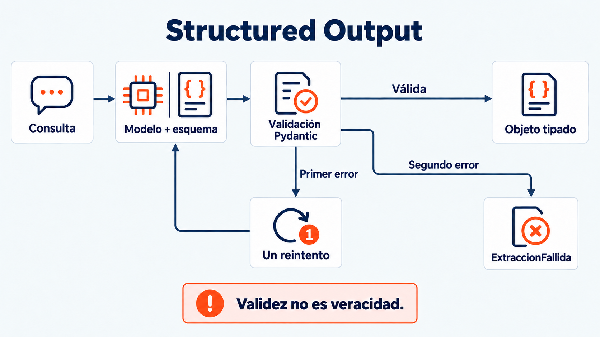

# Sesión 2 — Ecosistema LangChain: prompts, cadenas y modelos

> Semana 1 · jueves · **3.0 h teoría + 3.0 h práctica = 6 h**.

Antes de esta sesión: pre-work de 1 h ([`conceptos-previos.md`](conceptos-previos.md)) y el
**pase de entrada de Pydantic** entregado — sin él no se hace el L2 hoy.

---

## 1. Objetivos de aprendizaje

1. Explicar por qué el modelo es **stateless** y qué es realmente la "memoria" de un agente.
2. Escribir un prompt con la estructura **Rol + Contexto + Tarea + Formato** y justificar cada parte.
3. Decidir cuándo el **few-shot** rinde y cuándo solo gasta tokens (regla A5).
4. Definir un esquema Pydantic y obtener del modelo una **salida tipada y validada**.
5. Explicar por qué `with_structured_output()` **no basta** y qué añade `comun/structured.py`.
6. Medir el acierto de tu clasificador contra un conjunto de prueba, en vez de opinar sobre él.

---

## 0. De "primer llamado" a "primer contrato"

En la Sesión 1 el modelo devolvía texto. Hoy deja de ser suficiente: vas a pedirle una
**estructura** —un objeto con campos y tipos— y vas a tratar cualquier desviación de esa
estructura como un error, no como una curiosidad. Ese cambio de expectativa es el tema del día.

---

## 1. Mensajes, roles y *statelessness*

El modelo no tiene memoria entre llamadas. Lo que ves como "recordar" es tu código reenviando
el **historial completo como una lista de mensajes** (`system`, `human`, `ai`, y luego `tool`
desde la Sesión 3) en cada nueva llamada. Por eso el turno 10 de una conversación cuesta más
tokens que el turno 1: no es que la pregunta sea más larga, es que arrastra los 9 turnos
anteriores. Esto ya lo mediste en la demo 4 de la Sesión 0 — hoy lo vuelves a ver en
`code/04_tokens_y_costo.py`, aplicado a tu propio prompt.

---

## 2. Rol + Contexto + Tarea + Formato

La estructura de cualquier prompt de producción, en cuatro partes:

| Parte | Qué responde | Ejemplo (telco) |
|---|---|---|
| **Rol** | ¿Quién eres? | "Eres el asistente de AndesMóvil" |
| **Contexto** | ¿Qué sabes ya? | El vocabulario del sector, los límites de tu industria |
| **Tarea** | ¿Qué tienes que hacer con esta entrada? | "Clasifica la consulta del cliente en una categoría" |
| **Formato** | ¿Cómo debe verse la salida? | "Devuelve un objeto `Intencion` con categoría, urgencia y entidades" |

`comun/prompts_industria.py`, que ya usaste en la Sesión 1, es Rol + Contexto + los límites de
tu industria. Hoy le agregas la Tarea y el Formato para construir el prompt de clasificación.

---

## 3. Few-shot (regla A5)

Un ejemplo dentro del prompt ("clasifica esto → así") ayuda al modelo a entender un patrón
ambiguo mejor que cualquier descripción en prosa. Pero cada ejemplo se paga **en tokens, en
cada llamada** — no es gratis.

| Cuándo rinde | Cuándo solo gasta tokens |
|---|---|
| Enums con categorías parecidas entre sí | Categorías ya obvias por el vocabulario |
| Campos con un formato específico que hay que replicar | Texto libre sin restricción de forma |
| Ejemplos relevantes que resuelven errores observados | Ejemplos redundantes sin mejora medida |

**Dónde se ve esto hoy:** `code/02_few_shot.py` compara el mismo clasificador con 0, 2 y 4
ejemplos. Registra si mejora y cuánto cuesta: el efecto depende del modelo, los ejemplos y las consultas.

---

## 4. Structured Output: validación y recuperación de errores

`modelo.with_structured_output(Intencion)` recibe una clase Pydantic y valida la salida
según ese esquema. Una categoría fuera del Enum puede producir `ValidationError` durante
`invoke()`. Un objeto válido también puede clasificar mal: validación estructural y exactitud
semántica son comprobaciones diferentes.

La demo compara una invocación directa con `comun/structured.py`. No se promete que la
consulta ambigua falle: registrar lo observado. Para mostrar fallos y recuperación de forma
reproducible, usar `docente/verificar_structured.py`, que simula resultados controlados.

```text
extraer(modelo, Intencion, consulta)
  → with_structured_output aplica el esquema Pydantic
  → el wrapper detecta excepciones, None o tipo de retorno inesperado
  → reintenta una vez por defecto con una instrucción correctiva
  → devuelve el objeto o lanza ExtraccionFallida
```

El wrapper no implementa una segunda validación de todos los campos: comprueba el tipo del
objeto retornado y captura fallos de la integración. Para `ValidationError`, la instrucción
incluye el número de campos inválidos, no el detalle completo de cada campo.

Un reintento es el presupuesto elegido para el curso. Dos fallos no demuestran por sí solos
un defecto del prompt: también pueden deberse a infraestructura o restricciones del proveedor.
`reintentos` es configurable; los labs conservan el valor por defecto. Las demos pueden usar
la invocación directa para contrastar comportamientos; las soluciones L2 usan `extraer()`.

Fuente: [LangChain, modelos y salida estructurada](https://docs.langchain.com/oss/python/langchain/models).

---

## 5. Las 4 demos y el laboratorio

Ver [`code/README.md`](code/README.md) para las demos y [`lab/README.md`](lab/README.md) para
el Laboratorio 2 completo (clasificador de intención, medido contra el golden set).

---

## Qué NO entra hoy

| No entra | Va en |
|---|---|
| `@tool`, function calling, `args_schema` | Sesión 3 |
| `create_agent()` y el bucle ReAct | Sesión 3 |
| Llamadas a APIs externas y al simulador | Sesión 3 |
| RAG, embeddings, Qdrant | Sesión 5 |
| Memoria conversacional real (`thread_id`) | Sesión 5 |
| Guardrails y PII | Sesión 6 |
| Streaming | Sesión 11 (SSE de respuesta ya validada) |

> El L2 **llama a la API de inferencia, pero no al simulador ni a tools de negocio**: entra texto, sale estructura. Es la única
> sesión del curso en la que el modelo trabaja solo — nótalo, porque la Sesión 3 rompe ese
> aislamiento con el primer dato real.

## Recurso visual



Diagrama del mecanismo explicado en esta sesión; consultar el texto para sus límites. [Notas para el docente](../../imagenes/modulo-1-fundamentos/sesion-02-ecosistema-langchain/NOTAS-SLIDES.md).
