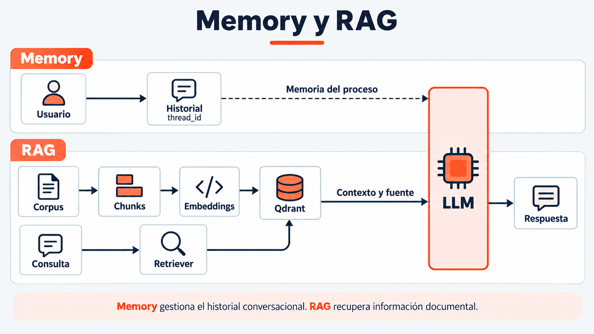

# Sesión 5 — Memoria contextual y RAG con Qdrant Cloud

> Semana 3 · martes · **3.0 h teoría + 3.0 h práctica = 6 h**. La sesión con más teoría del
> Módulo 2, y la más frágil operativamente: depende de Qdrant, un servicio que hasta hoy tu
> equipo no había usado.

**Bloqueante con fecha:** tu cluster de Qdrant debe estar *Healthy* **antes de hoy**. Pase de
entrada:

```bash
python -m comun.check_stack
```

Comprobaciones **6 y 7 en verde** (embeddings y Qdrant). Si fallas, avisa **hoy antes de la
sesión**, no durante el laboratorio: hay una colección de respaldo (`kb-<track>-respaldo`) para
seguir el laboratorio sin bloquearte, pero la ingesta la recuperas después con el checkpoint.

---

## 1. Objetivos de aprendizaje

1. Explicar qué es la memoria de un agente y cómo la implementa un `thread_id`.
2. **Defender** el tamaño de chunk de tu track: qué se gana y qué se pierde al partir un
   documento.
3. Indexar un corpus en Qdrant Cloud: colección, vector, payload.
4. Distinguir **RAG tradicional** de **RAG agéntico** y decir cuándo conviene cada uno.
5. Hacer que el agente **cite la fuente**, y explicar por qué eso es un requisito de auditoría y
   no un adorno.

---

## 0. El agente que no recuerda y el que no sabe

Hasta el L4, tu agente tiene dos carencias distintas que hoy resuelves con dos mecanismos
distintos:

- **No recuerda** — cada turno es una llamada nueva; si el cliente dice "¿y el mes pasado?", el
  modelo no tiene idea de qué se habló antes. Se resuelve con **memoria** (`thread_id`).
- **No sabe** — no tiene acceso a tarifas, coberturas ni políticas reales; cuando le preguntas,
  inventa (ya lo viste en la Sesión 1). Se resuelve con **RAG**.

Son dos problemas independientes. Confundirlos lleva a intentar arreglar alucinaciones con más
historial de conversación, lo cual no ayuda en nada.

---

## 1. Estado conversacional y `thread_id`

El modelo es *stateless*: no recuerda nada entre llamadas. Lo que llamamos "memoria" es, en
realidad, tu código reenviando el historial relevante en cada llamada, indexado por un
`thread_id` que identifica la conversación. Sin él, cada mensaje sería una conversación nueva.

---

## 2. Embeddings aplicados al dominio

Ya viste en la Sesión 0 que dos frases sin palabras en común pueden tener una similitud coseno
alta si significan lo mismo. Hoy lo aplicas al corpus real de tu track: "¿cuántos gigas me
quedan?" y "consulta del consumo de datos disponible" no comparten casi ninguna palabra, y aun
así deben recuperar el mismo fragmento del tarifario.

---

## 3. Chunking y su trade-off

El curso **fija** el tamaño de chunk por track — no lo eliges tú hoy, pero debes poder
defenderlo:

| Track | `chunk_size` | `overlap` | Por qué ese valor |
|---|---|---|---|
| telecomunicaciones | 400 | 60 | Tarifario: entradas cortas, tabulares, autocontenidas |
| banca | 400 | 60 | Comisiones y límites: párrafos breves e independientes |
| retail | 350 | 50 | Fichas de producto y política de devoluciones: muy breves |
| seguros | **600** | **100** | Condicionado legal: una cláusula partida por la mitad pierde su sentido |

| Si el chunk es… | Ventaja | Problema |
|---|---|---|
| Muy pequeño (~150) | Recuperación muy precisa | La cláusula queda amputada: el modelo lee media condición |
| Equilibrado (350-600) | — | — |
| Muy grande (~1500) | Nunca parte una idea | Cada resultado arrastra ruido, y se paga en tokens **en cada llamada** |

**Por qué se fijan y no se experimentan hoy:** re-indexar consume cuota de embeddings, y con 15
equipos, probar dos configuraciones duplica el consumo en la semana más cargada del curso. Quien
quiera optimizar el chunking lo hace en el **Proyecto M2 (Sesión 7)**, donde hay tiempo de
clínica para eso.

---

## 4. Qdrant: colección, punto, payload, filtros

| Término | Qué es |
|---|---|
| **Colección** | El equivalente a una tabla: un conjunto de vectores con la misma dimensión |
| **Punto** | Un vector + su `payload` — el equivalente a una fila |
| **Payload** | Los metadatos de cada punto: el texto original, el nombre del documento fuente, la sección. **Es lo que permite citar** |
| **Filtro** | Restringir la búsqueda por metadatos del payload (por ejemplo, solo el tarifario vigente) |

Sin payload con el nombre del documento fuente, tu agente puede recuperar el fragmento correcto
y aun así no poder decir de dónde salió — y "de dónde salió" es exactamente lo que pide la
salvaguarda A6.

---

## 5. RAG tradicional vs RAG agéntico

```
   RAG TRADICIONAL                      RAG AGÉNTICO
   ──────────────                       ────────────
   pregunta                             pregunta
      │                                    │
      ▼                                    ▼
   SIEMPRE busca                     ¿necesito buscar?  ── no ──► responde
      │                                    │ sí
      ▼                                    ▼
   pega los fragmentos                 llama al retriever como TOOL
      │                                    │
      ▼                                    ▼
   responde                            responde CITANDO
```

| | Tradicional | Agéntico |
|---|---|---|
| Latencia | Fija, siempre paga la búsqueda | Variable: no busca si no hace falta |
| "Hola, buenos días" | Busca igual: gasta y ensucia el contexto | No busca |
| Control | Total: siempre hay contexto | El agente **puede** decidir mal |
| Defensa cuando decide mal | — | **La salvaguarda A6** |

Tu Laboratorio 5 implementa **RAG agéntico**: el retriever es una tool más, con su propia
docstring que dice cuándo usarla (tarifas, coberturas, políticas) y cuándo no (consultas que ya
resuelve una de tus 4 tools del L4).

---

## 6. Salvaguarda A6 y la fundamentación

El system prompt de las 4 industrias ya lleva el bloque *recuperación obligatoria*
(`comun/prompts_industria.py`, función `get_system_prompt()`). La regla:

> Ante cualquier afirmación sobre **tarifas, coberturas, plazos o políticas**, el agente debe
> recuperar y citar. Si no encuentra fuente, dice que no lo sabe.

**Por qué esto es auditoría, no paranoia.** En telco, el regulador pregunta de dónde salió esa
tarifa; en seguros, de dónde salió esa cobertura. "El modelo lo dijo" no es una respuesta
admisible. Una respuesta sin fuente no se puede auditar — y eso importa más en Banca y Seguros
que en Retail, pero aplica a los cuatro tracks.

---

## La demo clave: por qué el conocimiento va al RAG y no al fine-tuning

Ver [`code/demo-parametrico-vs-recuperable.py`](code/demo-parametrico-vs-recuperable.py). Es la
demostración física de la personalización con prompts y RAG: cambiar un dato en Qdrant es
editar un documento; cambiarlo en los pesos del modelo sería reentrenar. Dura 5 minutos y
sostiene una decisión de arquitectura de todo el curso.

---

## Qué NO entra hoy

| No entra | Va en |
|---|---|
| Guardrails, PII, prompt injection | Sesión 6 |
| Pruebas de estrés y casos borde | Sesión 7 |
| Métricas de *groundedness* | Sesión 10 |
| Reindexación automática y pipelines de ingesta | Fuera del curso |

La Sesión 5 hace que el agente **cite**. Medir si esa cita realmente sostiene la respuesta
(*groundedness*) es la Sesión 10 — no intentes evaluarlo hoy con herramientas que todavía no
tienes.

## Recurso visual



La consulta y los documentos deben usar el mismo espacio de embeddings. La memoria del checkpoint vive en el proceso. [Notas para el docente](../../imagenes/modulo-2-agentes-avanzados/sesion-05-memoria-rag/NOTAS-SLIDES.md).
