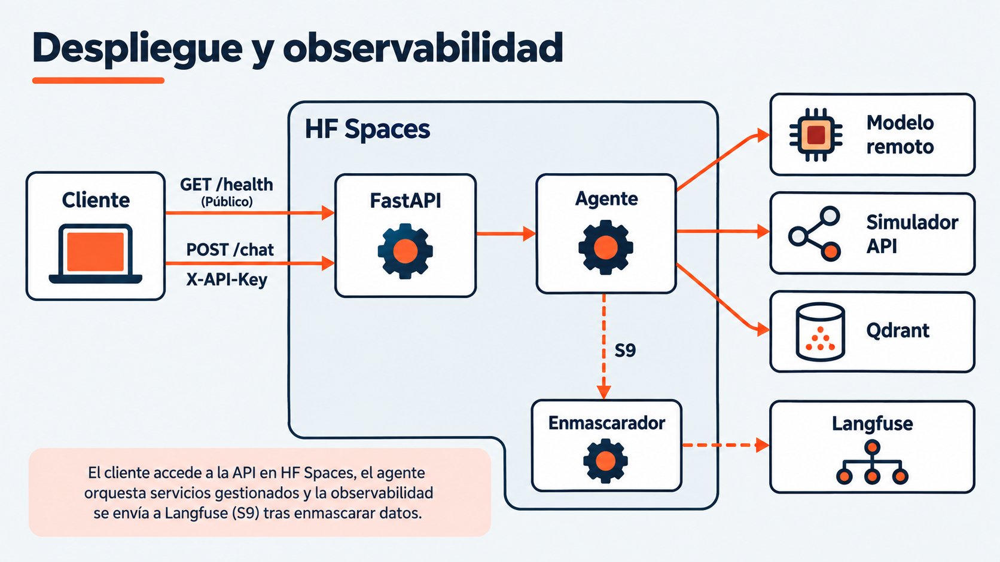

# Sesión 8 — Despliegue en producción con HF Spaces

> Semana 4 · jueves · **2.5 h teoría + 3.5 h práctica = 6 h**.

Antes de esta sesión: pre-work de 1 h ([`conceptos-previos.md`](conceptos-previos.md)) y una
cuenta de Hugging Face con un Space **vacío** ya creado (`git remote -v` debe mostrarlo).

---

## 1. Objetivos de aprendizaje

1. Explicar qué significa "producción" para un agente, y en qué se diferencia de un script que corre.
2. Escribir un `Dockerfile` **sin ejecutar Docker en local** (principio P2), y explicar cada línea.
3. Exponer el agente por **FastAPI** con `/chat` y `/health`, y explicar cómo el curso utiliza el segundo para verificar disponibilidad.
4. Gestionar secretos **en la plataforma**, no en el repositorio.
5. Proteger un endpoint público y explicar qué se protege: no el secreto, **la cuota**.
6. Explicar el *cold start* y por qué el primer request de un tier gratuito tarda.

---

## 0. Qué es "producción" para un agente

No es que corra: es que **otro lo invoque, sin ti delante**. Del L1 al L7 el agente vivió en tu
terminal, con tu `.env`, tus credenciales y tu supervisión. Hoy le das una URL pública, y a
partir de ahí puede llamarlo cualquiera que tenga la key — incluido un evaluador que nunca vio
tu código.

---

## 1. 12-Factor y config por entorno

El mismo código, tres entornos, cero cambios de código:

```
   TU LAPTOP (.env)          EL SPACE (Space secrets)        UN FUTURO ENTORNO
   HF_TOKEN=hf_xxx      ──►  HF_TOKEN=hf_xxx (secreto)  ──►  HF_TOKEN=hf_yyy
   QDRANT_URL=...             QDRANT_URL=...                  QDRANT_URL=...
```

`comun/settings.py` ya lee todo por variable de entorno desde el L1: hoy no se
escribe una sola línea de config nueva en el agente, solo se cambia **dónde vive** esa
configuración.

---

## 2. El `Dockerfile`, línea por línea

Se escribe hoy y **no se ejecuta en local** (principio P2): lo construye la plataforma al
recibir el `git push`. Ver [`solucion/<track>/Dockerfile`](solucion/telecomunicaciones/Dockerfile)
para la versión completa, comentada línea por línea.

---

## 3. FastAPI: qué va autenticado y qué no

```
   GET  /health   ──► SIN autenticación
                      El verificador del curso lo usa para comprobar disponibilidad.
                      No demuestra que los servicios externos estén sanos.

   POST /chat     ──► CON autenticación   (X-API-Key)
                      Cada llamada gasta cuota de HF Inference del equipo.
```

**Es la misma asimetría que ya consumiste como cliente.** El simulador de industria (S3) expone
`/health` abierto y todo lo demás con `X-API-Key`. Hoy publicas ese mismo patrón en vez de
consumirlo: cierra el círculo.

### Decisión: el `/chat` lleva API key propia del equipo

| | Decidido |
|---|---|
| `/health` | Público, sin credencial |
| `/chat` | Exige cabecera `X-API-Key` |
| Dónde vive la key | `AGENT_API_KEY` como **Space secret**, nunca en el repo |
| Cómo se evalúa "cualquiera puede invocarlo" | El equipo entrega la key al evaluador junto con la URL |

**Qué se protege: la cuota, no el secreto.** Los datos son sintéticos y las marcas ficticias; no
hay nada confidencial detrás. Lo que hay detrás es el token de HF Inference del equipo: un
`/chat` abierto que alguien descubra agota en horas un free tier que, además, todavía no está
medido.

---

## 4. Secretos en la nube

Un token de HF Inference filtrado en un commit se explota en minutos, no en días. La regla, sin
excepción: **nunca `.env` en el repo, siempre *Space secrets*.** Si un token aparece en el
historial de git, se revoca y se regenera — borrar el commit no basta, porque el historial de
git es recuperable y un scraper automatizado ya lo pudo haber indexado.

---

## 5. *Cold start* y el free tier

El primer request tras un periodo de inactividad tarda porque el Space **estaba dormido**: no es
un bug de tu código, es una propiedad económica del tier gratuito (la plataforma no mantiene
contenedores ociosos encendidos). Documentar esa latencia —cuánto tarda el primero contra el
segundo— es parte del entregable de hoy.

---

## 6. Las 4 demos y el laboratorio

Ver [`code/README.md`](code/README.md) para las demos y [`lab/README.md`](lab/README.md) para el
Laboratorio 8 completo (`app/api.py`, `Dockerfile`, despliegue real y Avance 1 del M3).

---

## 7. Qué NO entra hoy

| No entra | Va en |
|---|---|
| Trazabilidad y Langfuse | S9 |
| Evaluación y datasets | S10 |
| Cliente web con streaming | S11 |
| Foundry | bonus asíncrono |
| Docker en local, Kubernetes, CI/CD | fuera de alcance (P2) |

## Recurso visual



Langfuse se incorpora en S9; /health verifica el proceso, no todos los servicios externos. [Notas para el docente](../../imagenes/modulo-3-produccion/sesion-08-despliegue-hf-spaces/NOTAS-SLIDES.md).
