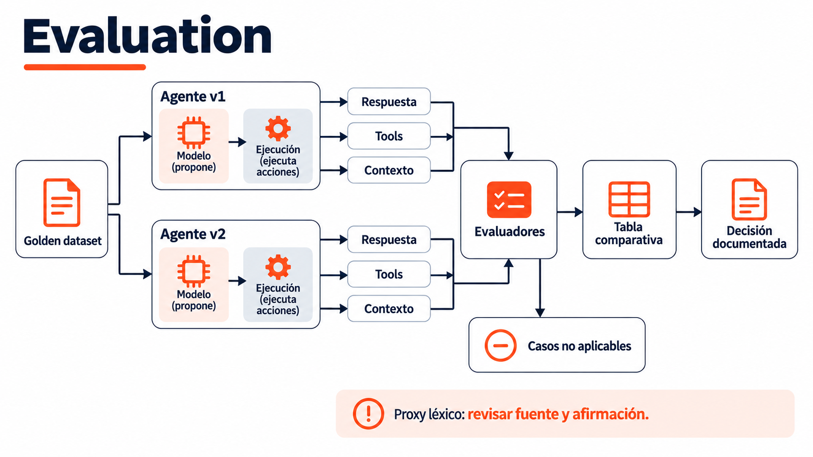

# Sesión 10 — Optimización continua y evaluación

> Semana 5 · jueves · **2.5 h teoría + 3.5 h práctica = 6 h**.

Antes de esta sesión: pre-work de 1 h ([`conceptos-previos.md`](conceptos-previos.md)) y tu
`INFORME-L9.md` del L9 con los 2 cuellos de botella documentados.

---

## 1. Objetivos de aprendizaje

1. Explicar por qué `assert respuesta == "esperado"` no sirve, y qué lo reemplaza.
2. Aplicar evaluators **determinísticos** y explicar las limitaciones de sus proxies de exactitud y groundedness.
3. Explicar qué es **LLM-as-judge**, cuándo sirve y cuáles son sus sesgos.
4. Comparar dos versiones de prompt sobre el mismo dataset y decidir con el número.
5. Distinguir una mejora real de ruido de muestreo.

---

## 0. Mejorar con evidencia, no con intuición

Retomas los 2 cuellos de botella de tu Avance 2 (S9): hoy los atacas. No se optimiza "a
ojo" — se mide antes, se cambia una cosa, se mide después.

---

## 1. El golden dataset era el de siempre — la espina dorsal del curso

```
   recursos/golden/consultas-<track>.json          30 casos por track
   │
   ├── 20 con tool esperada  ──► S2 · L2   clasificar intención
   │                         ──► S4 · L4   seleccionar herramienta
   ├── 10 de categoría OTRO  ──► S5 · L5   recuperar y citar
   └── los 30 juntos         ──► S10 · L10 evaluar v1 contra v2
```

Llevas nueve sesiones viendo las mismas consultas y hoy descubres que eran un **golden
dataset** desde el primer día. Un conjunto de evaluación no se improvisa al final: se
construye mientras se construye el sistema.

⚠️ **Prerrequisito ya cerrado:** las 10 consultas OTRO por track y el campo
`respuesta_esperada` en las 30 filas (sin eso no hay evaluación automática).

---

## 2. Los 3 evaluators determinísticos

| Evaluator | Qué mide | Cómo se calcula, sin modelo de por medio |
|---|---|---|
| **Uso correcto de tool** | ¿Llamó a la herramienta esperada? | Comparar el `tool_call` contra `tool_esperada` del dataset. **Es `matriz_seleccion.py`**, que existe desde el L4 |
| **Exactitud** | ¿La respuesta contiene el dato correcto? | ¿Aparece `respuesta_esperada` (o su valor clave) en el texto? |
| **Groundedness por cita** | ¿Aparece el dato esperado en respuesta y contexto? | Busca una subcadena en ambos: no verifica cita, atribución, negación ni respaldo semántico |

Ver `comun/evaluadores.py` — los 3 se pueden correr mil veces y dan lo mismo. Eso es lo que
los hace aptos para calificar, y lo que los distingue del juez.

---

## 3. LLM-as-judge: se enseña, no califica

**El juez es demo. La nota la sostienen los tres evaluators determinísticos.**

```
   1.  Tomar 10 casos ya puntuados por los evaluators determinísticos
   2.  Pasarlos por el juez (el mismo Qwen3-32B)
   3.  Poner las dos columnas lado a lado y buscar los desacuerdos
```

| Sesgo | Cómo se manifiesta |
|---|---|
| **Autoevaluación** | El modelo puntúa mejor sus propias salidas que las de otro modelo |
| **Verbosidad** | Una respuesta larga y segura puntúa alto aunque sea falsa |
| **Posición** | En comparaciones A/B, la primera opción tiende a ganar |
| **Autocomplacencia** | Ante la duda, aprueba |

**Por qué igual se enseña.** Es la técnica que vas a encontrar en toda la industria, y para lo
que sirve de verdad —criterios subjetivos como tono o utilidad, donde no hay evaluator
determinístico posible— es insustituible. Lo que no puede es sostener una nota, ni un informe a
un cliente, sin decir su margen de error.

---

## 4. Cuándo una mejora es real

```
   v1: 24/30 = 80.0 %
   v2: 26/30 = 86.7 %        ¿mejoró?   ── depende ──►  ¿se corrió dos veces?
                                                        ¿los 2 casos ganados son
                                                        siempre los mismos?
```

Con 30 casos, **dos aciertos de diferencia pueden ser ruido.** La regla del curso: una mejora se
reporta cuando se sostiene en dos corridas y se puede señalar **qué cambio la produjo**. Esta es una regla exploratoria del curso, no una prueba de significancia ni una demostración
causal. Registrar variabilidad y evitar conclusiones generales con una muestra pequeña.

---

## 5. Las 4 demos y el laboratorio

Ver [`code/README.md`](code/README.md) para las demos y [`lab/README.md`](lab/README.md) para
el Laboratorio 10 completo (dataset en Langfuse, línea base v1, un cambio dirigido, v2).

---

## 6. Qué NO entra hoy

| No entra | Va en |
|---|---|
| El cliente web y la demo final | S11 |
| RAGAS en profundidad | mención y enlace; complemento opcional |
| Evaluación en CI / pipeline automatizado | se menciona como cierre, no se implementa |
| Fine-tuning como vía de mejora | fuera del alcance; se trabaja con prompts y RAG |

## Recurso visual



Flujo de reporte recomendado: la separación de casos no aplicables se registra además del resultado del evaluador actual. [Notas para el docente](../../imagenes/modulo-3-produccion/sesion-10-evaluacion-optimizacion/NOTAS-SLIDES.md).
